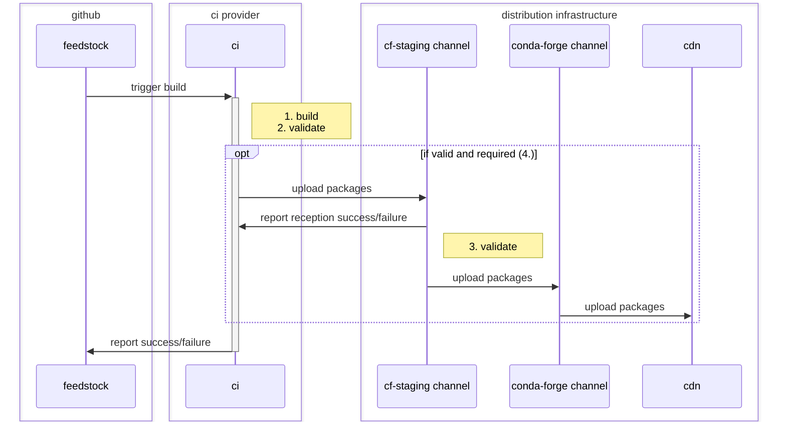
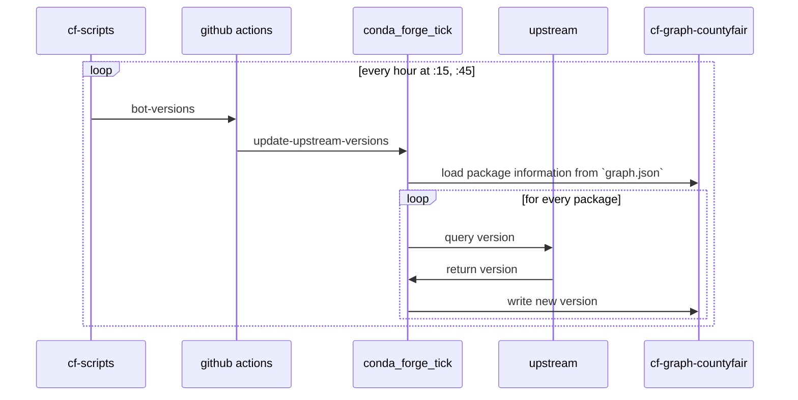
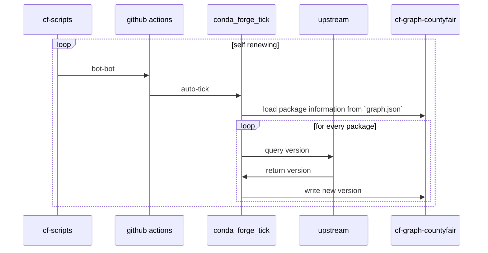

# The feedstock

A feedstock is the home of one recipe; it may produce more than one package in the case of a multi-output recipe.
The feedstock is the stage for most events about a recipe.

## Initialization

The feedstock repository is created following the merging in `staged-recipes` (see [here](../staged_recipes#feedstock-creation) for details on that process).

## Package building

### Package publication sequence

Package building can be triggered by several events, which are described below.
In all of those cases, the following sequence plays out.

:::note

1. The build itself is carried out in a docker container on the ci.
2. The validation checks that the artifacts produced during the build are permissible for this feedstock by consulting [the `feedstock-outputs` repo](/docs/maintainer/infrastructure/#feedstock-outputs)
3. The server-side validation is essentially the same as 2. It is repeated to guard against potential intentional or unintentional interference at the feedstock level, which is easier to access.
4. The upload is only triggered if the validation (2.) was successful. Additionally, it is only performed under certain conditions, for example for commits in `main`, but _not_ in PRs.

:::

### Package building events

Package building is either triggered as part of a PR or on commits to branches in the feedstock repository (which in turn usually stem from the merging of PRs).
:::warning
_Any_ commit on _any_ branch in the feedstock can lead to the building and publication of a package.
To avoid the gratuitous publication of improper packages, development branches MUST NOT be added to the feedstock repository.
Instead, they live in forks of the feedstock repository and the associated work is added only via pull requests.
:::

Almost all changes to the feedstock repo are performed via PRs.
This is true both for manual maintainer intervention and conda-forge automation.
However, it is possible to add commits to branches directly.
This is occasionally used to re-trigger a failed ci run with an empty commit.

There is a variety of situations in which the conda-forge automation will create PRs.
In these cases, it is generally the privilege of the feedstock maintainers to merge the PR, triggering the action on the repository.

Every commit on a branch will trigger the ci _unless_ its commit message contains the tag `[ci skip]`, which can be achieved for PRs by including it in the PR title.

#### Version updates

When a new version is released upstream, a PR needs to be created that performs the necessary updates to the feedstock.
At a minimum, that includes updating the version, download url, and hash of the upstream source artifact.
In addition, other changes to the recipe may be needed, such as updated dependency requirements, a change to the `noarch` status of the package, or an adaptation of the build or test scripts.
While these last changes often need to be done by the maintainers, conda-forge has sophisticated capabilities to add the initial version update PR.
This happens in two steps in the ci of [`cf-scripts`](https://github.com/regro/cf-scripts).

First, the version information is updated from upstream sources and stored in the [`cf-graph-countyfair` repo](/docs/maintainer/infrastructure/#regrocf-graph-countyfair), more specifically in the `versions` directory tree, nested by hash with one file per package.

Second, the main bot ci job, the `bot-bot` action in [`cf-scripts`](/docs/maintainer/infrastructure/#regrocf-scripts) creates PRs for all packages that have a new version available upstream.

#### Rebuilds for migrators

## Non-package building events

### `add maintainer`
