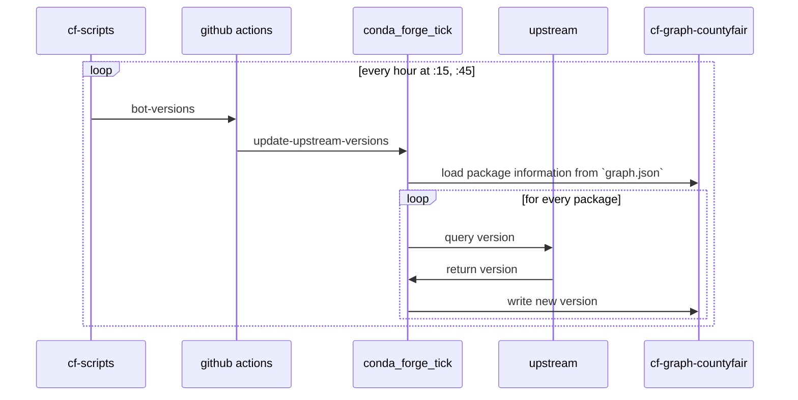
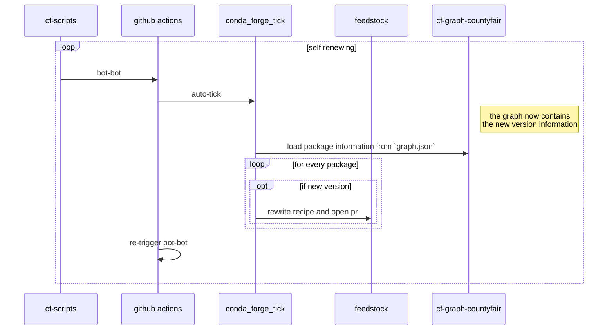
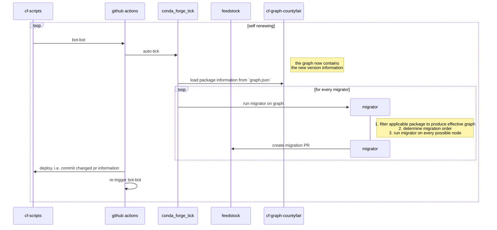

# The feedstock

A feedstock is the home of one recipe; it may produce more than one conda artifact in the case of a multi-output recipe.
The feedstock is the stage for most events about a recipe.

## Initialization

The feedstock repository is created following the merging in `staged-recipes` (see [Feedstock creation](staged_recipes.md#feedstock-creation) for details on that process).

## Package building diagram

Package building can be triggered by several events, which are described in the next section.
In all of those cases, the following sequence plays out.


:::note

1. For Linux and `noarch` packages, the build itself is carried out in a Docker container on the CI. On macOS and Windows, the CI runner system image is used after tuning it a bit.
2. The validation checks that the artifacts produced during the build are permissible for this feedstock by consulting [the `feedstock-outputs` repository](/docs/maintainer/infrastructure/#feedstock-outputs).
3. The server-side validation is essentially the same as 2. It is repeated to guard against potential intentional or unintentional interference at the feedstock level, which is easier to access.
4. The upload is only triggered if the validation (3.) was successful. Additionally, it is only performed under certain conditions, for example for commits in `main`, but _not_ in PRs.

:::

## Events that trigger new builds

Package building is either triggered as part of a PR or on commits to branches in the feedstock repository (which in turn usually stem from the merging of PRs).

:::warning
_Any_ commit on _any_ branch in the feedstock can lead to the building and publication of a package.
To avoid the gratuitous publication of improper packages, development branches MUST NOT be added to the feedstock repository.
Instead, they live in forks of the feedstock repository and the associated work is added only via pull requests.
:::

Almost all changes to the feedstock repository are performed via PRs.
This is true both for manual maintainer intervention and conda-forge automation.

:::info
It is possible to add commits to branches directly.
This is occasionally used to re-trigger a failed CI run with an empty commit:

```console
git commit --allow-empty -m "Retrigger CI"
```
:::

### Manually submitted PRs

These PRs are not automated. Any Github user can open a new PR by forking the feedstock, creating a fresh branch from `main` and adding the necessary commits to achieve the intended change (e.g. building a new version or adding a new platform).

It is up to the feedstock maintainers and/or the conda-forge/core team to review, approve and merge the PR, or to reject it and close it.

During the lifetime of the PR, some automated operations will take place:

- The linter will scan the state of the recipe to require changes and suggest improvements. If not fulfilled, this will result in a failed CI run. Linter failures must **not** be ignored without explicit core approval.
- The PR template will ask you to rerender the feedstock at least once per PR. This will ensure that the CI configuration is up-to-date, among other things. You can use the bot command `@conda-forge-admin please rerender` in any comment, or do it locally via `conda-smithy rerender`.

### Automated PRs

There is a variety of situations in which the conda-forge automation will create PRs.
In these cases, it is generally the privilege of the feedstock maintainers to review and merge the PR, triggering the action on the repository.

Every commit on a branch will trigger the ci _unless_ its commit message contains the tag `[ci skip]`, which can be achieved for PRs by including it in the PR title. Some providers ignore this tag during PRs but do obey in runs triggered by a branch like `main`.

#### Version updates

When a new version is released upstream, a PR needs to be created that performs the necessary updates to the feedstock.
At a minimum, that includes updating the version, download URL, and hash of the upstream source artifact.
In addition, other changes to the recipe may be needed, such as updated dependency requirements, a change to the `noarch` status of the package, or an adaptation of the build or test scripts.
While these last changes often need to be done by the maintainers, conda-forge has sophisticated capabilities to add the initial version update PR.

:::info How does it work?

This happens in two steps in the CI of [`cf-scripts`](https://github.com/regro/cf-scripts).

First, the version information is updated from upstream sources and stored in the [`cf-graph-countyfair` repo](/docs/maintainer/infrastructure/#regrocf-graph-countyfair), more specifically in the `versions` directory tree, nested by hash with one file per package.



Second, the main bot CI job, the `bot-bot` action in [`cf-scripts`](/docs/maintainer/infrastructure/#regrocf-scripts) creates PRs for all packages that have a new version available upstream.
Here is a simplified diagram of how that is done. For the full picture, read [below](#rebuilds-for-migrators).


:::

Once submitted, it is up to the feedstock maintainers to check the PR, make any necessary adjustments, and merge it into the feedstock branch.

This version update is an example of a migrator. Read more about migrators in the following section.

#### Rebuilds for migrators

The version update is one example of a migrator.
In reality, there are more occasions and reasons to update recipes, for example, to recompile an otherwise unchanged binary program or library to link against a newer version of a dependency or to add support for a new architecture.
This kind of use case is handled by migrators, which are a general recipe rewriting tool.

A more complete picture of what `auto-tick` does is the following:



Migrators are a powerful mechanism that can do almost arbitrary recipe changes. They are written in Python. The current set of migrators can be found in the [`regro/cf-scripts` repository](https://github.com/regro/cf-scripts/tree/master/conda_forge_tick/migrators).
