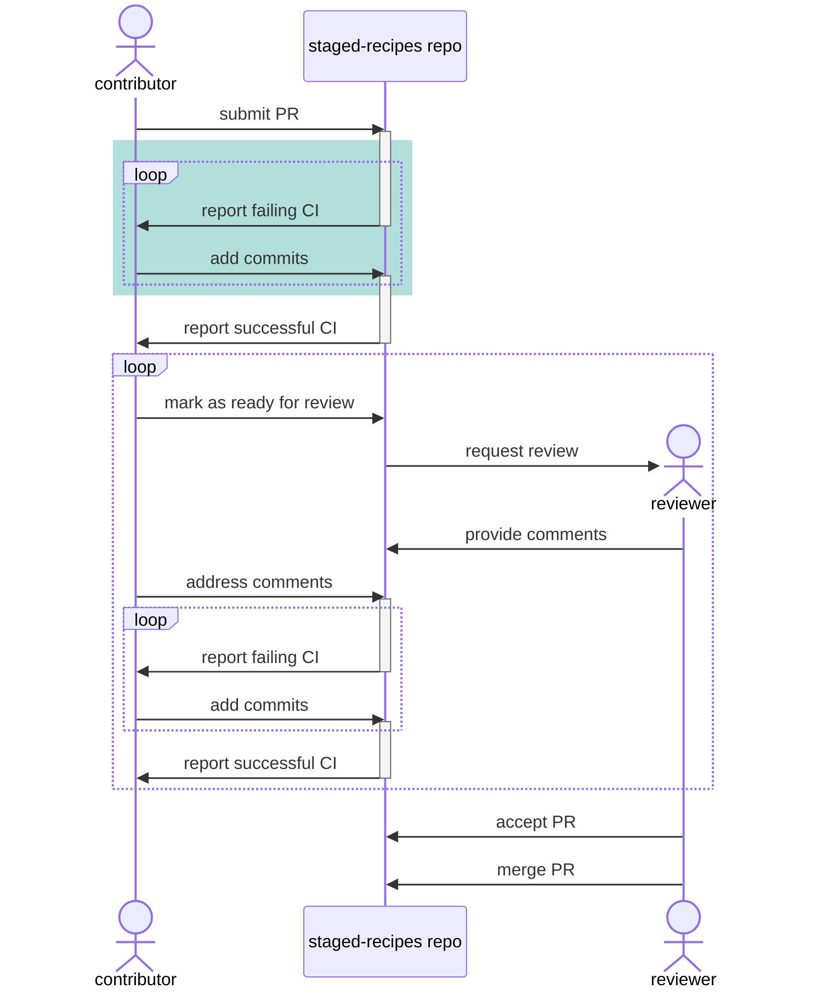

# Submission to staged-recipes

[`staged-recipes`](/docs/maintainer/infrastructure#staged-recipes) is the gateway to conda-forge.
Every package published has gone through this repository as part of the submission process.

Users normally follow these steps:

1. Fork the `conda-forge/staged-recipes` repository and create a new branch from `main`.
2. Add `meta.yaml` (and other files as needed) in a new subdirectory under `recipes/`.
3. Open a new pull request and pass the CI checks, which include building the recipe under different operating systems and some static analysis of the recipe files (linting).
4. Ask for a review and apply the suggestions.

When the PR is approved and merged to `main`, the new directory under `recipes/` will trigger the `staged-recipes` pipelines, which will create a new feedstock with the recipe contents.

